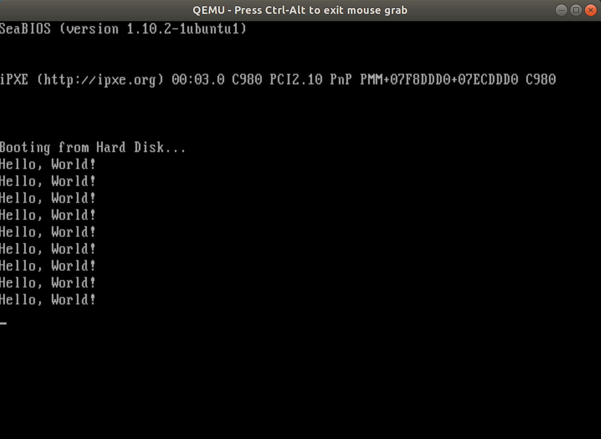

# lab1 实验报告

姓名：刘佳璇

学号：231220105

邮箱：13573529579@163.com

## 实验进度

我完成了所有内容

## 实验结果

**start_1:**

**start_2:**

**start_3:**

## 实验修改的代码位置

**start_1.s:**

`15`-`33`行

​	添加重定向`IRQ0`中断的代码，将其指向中断处理程序`clock_handle`；

​	设置8254定时器芯片。

`40`-`69`行

​	添加中断处理程序`clock_handle`，准备阶段进行中断计数，每50次进入`print_loop`段打印字符串，否则进入`skip_print`段发送结束中断信号。

`74`-`75`行

​	添加全局变量`counter`，用于累计中断次数。

**start_2.s:**

`13`行

​	添加关中断指令`cli`。

`24`-`26`行

​	设置`CR0`寄存器的`PE`位为1。

`47`-`60`行

​	将`"Hello, World!\0"`的ASCII码写入`graphics segment`的相应位置。

`79`-`89`行

​	初始化`GDT`。

**start_3.s:**

`13`行

​	添加关中断指令`cli`。

`24`-`26`行

​	设置`CR0`寄存器的`PE`位为1。

`79`-`89`行

​	初始化`GDT`。

**boot.c:**

`7`-`9`行

​	调用`readSect`加载磁盘 1 号扇区中的`“Hello World”`程序到内存`0x8c00`处；

​	用函数指针调用`“Hello World”`程序。